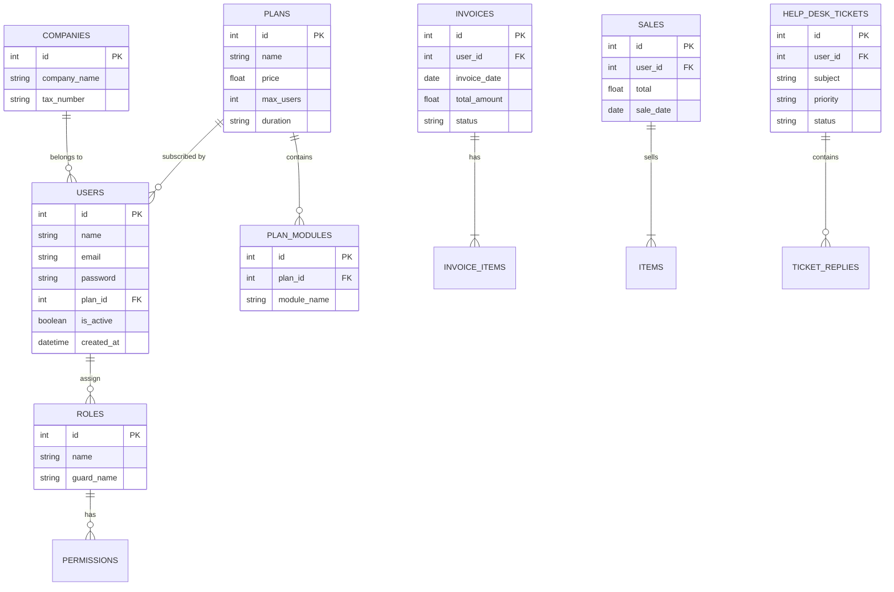

# 🗄️ مخطط قاعدة البيانات والعلاقات (Database Constraints & ERD)

يعتمد النظام على هيكل قواعد بيانات متطور ومترابط يخدم أغراض (SaaS) وتعدد الشركات وتعدد الوحدات. لتوضيح العلاقات، نورد أدناه التصميم المفاهيمي والمخطط الكياني للعلاقات (ERD):

## 1. نموذج الكيانات (Mermaid ERD Diagram)

## 2. شرح الجداول والعلاقات الأساسية

1. **جدول المستخدمين `users`:**
   المحور الأساسي في النظام، يمتلك الصلاحيات، ويكون مرتبطاً بـ (Roles) لتحديد مستوى وصوله. إذا كان المستخدم هو مدير شركة، فإنه يرتبط بباقة (Plan) معينة تحدد الموارد المسموحة له.

2. **جدول الباقات `plans`:**
   يحتوي على تفاصيل الأسعار، فترات الاشتراك، والوحدات المضافة (Add-ons) المتاحة لتلك الباقة وتتصل بجدول وسيط لتنظيم الوحدات المسموحة لكل خطة شرائية.

3. **جداول الفواتير والمبيعات `invoices` & `sales`:**
   تمثل الشق المالي للشركات. الفاتورة الواحدة تحتوي على عناصر `invoice_items` متصلة بقاعدة المنتجات والخدمات والمخازن `warehouses`.

4. **جداول المساندة والدعم `helpdesk_tickets`:**
   تتيح للمستخدمين فتح تذاكر يتم تصنيفها بحسب الفئات (Categories) ويتم الرد عليها من قبل المشرفين، مما يؤسس نظام دعم داخلي للـ SaaS.

## 3. التدرج الأمني وصلاحيات Spatie

يتم تطبيق حزمة `Spatie/laravel-permission` كطريقة قياسية لربط المستخدمين والمهام بالصلاحيات. هذا يضمن أن لا يتمكن المستخدم إلا من رؤية الوحدات المفعلة له ولشركته ضمن الخطة المدفوعة، ولا يستطيع التحكم ببيانات مستأجر (Tenant) آخر في نفس مساحة التخزين الخاصة بالمنصة.
